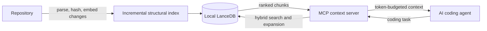

# code-intel

[](https://www.npmjs.com/package/@pranitmodi/code-intel)
[](https://github.com/pranitmodi/code-intel/actions/workflows/ci.yml)
[](LICENSE)
[](package.json)

**Persistent, local-first repository context for AI coding agents.**

Coding agents repeatedly list, search, and read the same repository. `code-intel` indexes that knowledge once, keeps it current as files change, and gives the agent a small, ranked context package over the [Model Context Protocol](https://modelcontextprotocol.io).

The default path uses local [Ollama](https://ollama.com) embeddings and on-disk [LanceDB](https://lancedb.github.io/lancedb/). Cursor, VS Code, Claude Code, Codex, and other MCP clients can share the same index.

> **Measured on this repository:** task-context retrieval used **73.9% fewer estimated input tokens** than the workspace-scan baseline, with **0.96 Recall@10**, **0.84 MRR**, and **708 ms p95**. This is an eight-task TypeScript regression benchmark, not a universal cost guarantee. See [methodology and complete results](docs/BENCHMARKS.md).

## Why use it?

- **Less repeated context:** return relevant symbols and files instead of dumping the tree.
- **Task-aware retrieval:** `get_task_context` combines semantic, keyword, symbol, path, and relationship signals.
- **Incremental by design:** only changed chunks are embedded; unchanged vectors are reused.
- **Local-first privacy:** Ollama is the default and no telemetry is enabled.
- **Agent-safe fallback:** stale or low-confidence retrieval permits targeted filesystem search.
- **Inspectable quality:** explain traces and a labeled benchmark expose ranking, misses, token budgets, and latency.

## How it works



The write path discovers files, creates Tree-sitter symbol chunks where supported, hashes content, and embeds only changes. The read path analyzes a task, retrieves candidates, expands imports/references/tests/configuration, removes redundancy, and packs the result under a hard token budget.

Read the full [architecture](docs/ARCHITECTURE.md), [benchmark methodology](docs/BENCHMARKS.md), and [security model](SECURITY.md).

## Installation

Requires Node.js 20+. The default provider also requires [Ollama](https://ollama.com/download); an OpenAI-compatible endpoint can be used instead.

```bash
npm install -g @pranitmodi/code-intel
cd /path/to/your-project
code-intel onboard                 # pull the model if needed, index, wire Cursor
```

That one command replaces `ollama pull`, `doctor`, `setup`, and `cursor-install`. Reload MCP in Cursor (Settings → MCP) afterward.

The package is scoped (`@pranitmodi/code-intel`) because npm rejected unscoped `code-intel` as too similar to existing [`codeintel`](https://www.npmjs.com/package/codeintel). The installed command is still `code-intel`.

Without a global install you can use `npx`:

```bash
npx -y @pranitmodi/code-intel onboard --repo /path/to/your-project
```

From a git checkout (contributors):

```bash
./scripts/dev-link.sh              # npm install + build + npm link
```

## Ollama setup

```bash
ollama pull nomic-embed-text   # default embedding model, ~274MB
```

`code-intel onboard` and `code-intel doctor --fix` pull that model for you if Ollama is running and the model is missing. `code-intel doctor` without `--fix` only reports whether Ollama and the model are reachable.

## OpenAI-compatible embeddings

Any compatible `/embeddings` service can be used: a hosted provider, an organization-managed gateway, or a local service. Review that provider's source-code retention and training policies before indexing private repositories.

### One-command setup

From the repository, run:

```bash
code-intel wizard
```

It first asks whether to use **local Ollama** or an **OpenAI-compatible provider**. If you choose the provider, it prompts for API key (hidden in the terminal and not saved to YAML), optional username, model, and endpoint, then validates, rebuilds the index, and wires Cursor. `code-intel corporate-setup` is an alias that starts directly on the managed-provider route.

For a non-interactive managed rollout:

```bash
code-intel corporate-setup --non-interactive \
  --model your-embedding-model \
  --base-url https://embeddings.example.com/v1 \
  --embeddings-path /embeddings
```

That path still requires `CODE_INTEL_EMBEDDING_API_KEY` in the environment (or `--api-key` for a one-off; it is not written to YAML). Managed TLS can use Node's system certificate store without disabling verification. Use a current Node release supporting `--use-system-ca`; on older/custom installations, set `NODE_EXTRA_CA_CERTS` to the organization CA PEM file.

### Manual configuration

Model name, base URL, and path are all configurable. Set them once globally so every repo using the npm package picks them up:

`~/.local-code-intelligence/config.yaml`

```yaml
embedding:
  provider: openai-compatible
  model: your-embedding-model
  base_url: https://embeddings.example.com/v1
  embeddings_path: /embeddings       # use /v1/embeddings if your API lives under /v1
  batch_size: 32
  timeout_ms: 60000
  use_system_ca: true                # trust company certificates installed by IT
```

You can also set a per-repo `.code-intel/config.yaml`, environment variables, or one-off CLI flags (later wins):

```bash
export CODE_INTEL_EMBEDDING_PROVIDER=openai-compatible
export CODE_INTEL_EMBEDDING_MODEL='your-embedding-model'
export CODE_INTEL_EMBEDDING_BASE_URL='https://embeddings.example.com/v1'
export CODE_INTEL_EMBEDDING_PATH='/embeddings'
export CODE_INTEL_EMBEDDING_API_KEY='your-key'
export CODE_INTEL_EMBEDDING_USER='your-username'   # only if the endpoint requires a user field

code-intel doctor
code-intel setup --embedding-provider openai-compatible \
  --embedding-model your-embedding-model \
  --embedding-base-url https://embeddings.example.com/v1
```

Put the same `CODE_INTEL_EMBEDDING_*` variables in the MCP server environment so the IDE process can embed search queries. Keys are never read from YAML. If the repository was already indexed with another model, run `code-intel rebuild`.

## Initial indexing

From the root of the repository you want to index:

```bash
cd /path/to/your-project
code-intel onboard   # model + index + Cursor (first time)
code-intel setup     # scaffold + index only
code-intel status    # files/chunks indexed, database size, staleness check
```

Or the two-step form: `code-intel init` then `code-intel index`.

The index lives outside your repo by default (see **Database location**), so nothing is written into your project and no `.gitignore` changes are needed.

Re-run `code-intel index` any time after editing files — only new/changed chunks are re-embedded. The MCP server starts incremental watchers by default for every indexed repo under the workspace (including child projects in a parent folder). Edits are re-indexed after a quiet period (`indexing.debounce_ms`, default 1s), and unchanged chunks are never re-embedded. `code-intel watch` is the same loop as a standalone process; `code-intel mcp --no-watch` or `indexing.watch: false` turns it off.

## CLI usage

```text
code-intel onboard                 pull model if needed, index, wire Cursor
code-intel wizard                  interactive Ollama vs company-proxy setup
code-intel setup                   scaffold + index in one step
code-intel setup --cursor          setup plus Cursor MCP / rule / skill
code-intel corporate-setup         company-proxy wizard (prompts for key/user)
code-intel init                    scaffold the index location
code-intel index                   full/incremental index
code-intel watch                   incremental re-index on file changes
code-intel repos                   list every locally indexed repository
code-intel search "<query>"        hybrid semantic+keyword+symbol search
code-intel search "<query>" --explain   score breakdown, diversity, token budget
code-intel context "<task>"        assemble a task-oriented context package
code-intel context "<task>" --mode minimal --max-tokens 8000 --explain
code-intel symbol <name>           exact/fuzzy symbol lookup
code-intel file <path> [--start N --end M]   exact source content
code-intel status                  repo/index status
code-intel doctor                  diagnose embedding provider/model/database health
code-intel doctor --fix            same, and pull a missing Ollama model
code-intel rebuild                 wipe and fully re-index (backfills extra_metadata)
code-intel clean                   remove the local index (not your source)
code-intel cursor-install          merge ~/.cursor/mcp.json and write the user rule
code-intel mcp                     start the MCP server over stdio (watch on by default)
code-intel mcp --no-watch          start the MCP server without file watchers
code-intel savings                 estimate token/$ savings vs tree scans
code-intel savings --benchmark     re-run the Grep vs search A/B on indexed repos
code-intel benchmark               labeled retrieval quality vs workspace-scan baseline
code-intel benchmark --format json --task <id>
```

Every command accepts `--repo <path>` to target a repository other than the current directory — this is what makes MCP configuration below work regardless of the IDE's spawn working directory.

Embedding knobs (also available as YAML / env) can be passed on any command:

```text
--embedding-provider ollama|openai-compatible
--embedding-model <name>
--embedding-host <ollama-url>
--embedding-base-url <openai-compatible-origin-or-full-embeddings-url>
--embedding-path <path>   # default /embeddings
```

## Measuring savings

`code-intel savings` compares local retrieval to a typical agent tree scan (workspace Glob + `rg -C 2` + reading the first 12 matching files). It does **not** see Cursor's invoice; it estimates input tokens that never reach the model.

```bash
code-intel savings --benchmark --rate 3 --turns 15
```

`--benchmark` runs that A/B on every indexed repo (needs the configured embedding provider and `rg`). Live MCP searches and blocked workspace Grep/Glob (from `cursor-install` hooks) append to `~/.local-code-intelligence/usage.jsonl`. Re-run `code-intel savings` after a real coding session to see session totals.

Dollar figures use `--rate` as dollars per million **input** tokens. `--turns` models a dump remaining in later turns. Both are illustrative: provider caching, client behavior, pricing, and context management determine the actual bill.

The separate labeled retrieval benchmark checks whether smaller context is still relevant:

```bash
code-intel benchmark
code-intel benchmark --format json --task known-search-codebase
```

See [Benchmarks](docs/BENCHMARKS.md) for the baseline, formulas, complete measured result, dataset ceiling, limitations, and reproduction steps.

## MCP configuration

### VS Code

Add to `.vscode/mcp.json` in your project (see [examples/mcp/vscode.mcp.json](examples/mcp/vscode.mcp.json)):

```json
{
  "servers": {
    "local-code-intelligence": {
      "command": "code-intel",
      "args": ["mcp", "--repo", "${workspaceFolder}"]
    }
  }
}
```

Reload/trust the server when prompted, then ask Copilot Chat to use the tools (or let it pick them up automatically). To use a custom embedding endpoint from the IDE, add an `env` map with `CODE_INTEL_EMBEDDING_PROVIDER`, `CODE_INTEL_EMBEDDING_MODEL`, `CODE_INTEL_EMBEDDING_BASE_URL`, and `CODE_INTEL_EMBEDDING_API_KEY`.

### Cursor

The reliable setup after `npm install -g @pranitmodi/code-intel` (or `npm link` from a checkout):

```bash
code-intel cursor-install
```

That merges `~/.cursor/mcp.json` (it will not drop other MCP servers), writes an always-on user rule and skill, and installs hooks that:

- Inject the indexed-repo list at session start
- Block workspace-wide Grep/Glob and Task `explore` so the agent has to hit `get_task_context` / `search_codebase` first (targeted filesystem search is allowed after low-confidence retrieval)

Then reload MCP in Cursor (Settings → MCP).

The checked-in example is [examples/mcp/cursor.mcp.json](examples/mcp/cursor.mcp.json) (`code-intel mcp --repo ${workspaceFolder}`). `cursor-install` writes an equivalent server entry that points at the installed package's `dist/cli/index.js` (so Cursor does not need `code-intel` on its GUI `PATH`). Tools accept an optional `repo` (path, id, or basename) so a parent workspace can query indexed children. The server starts file watchers for those indexed repos by default so new and edited code is chunked incrementally.

Note the different top-level key (`mcpServers` vs VS Code's `servers`) — this is a real difference between the two clients' config formats, not a typo.

Both IDEs will then list `get_task_context`, `search_codebase`, `search_symbol`, `get_file_context`, `get_repo_context`, `find_references`, `list_indexed_repos`, and `index_status`. Retrieval uses the persistent index first; targeted filesystem search remains available when the index is stale, missing, or low confidence.

## Database location

Default: `~/.local-code-intelligence/repos/<repo-id>/{db,metadata,state.json,logs}`, where `<repo-id>` is a SHA-256 hash of the repository's real absolute path. A `registry.json` in the same home directory maps those ids back to paths and names (`code-intel repos`). Override via `database.path` in config or the `CODE_INTEL_DB_PATH` environment variable. If you point it inside the repo, the directory is automatically added to `.gitignore`.

## Privacy behavior

- With the default local Ollama host, source code, chunks, embeddings, and the vector database stay on this machine. A remote Ollama host is a remote provider.
- With an OpenAI-compatible provider, chunks and semantic search queries are sent to the configured endpoint; embeddings and LanceDB remain local.
- No telemetry or third-party cloud API is enabled by default.
- `.env*`, private keys, and other secret-shaped files are excluded by default (`security.allow_sensitive_files: false`); files with likely secret *values* are skipped even if their name would otherwise be allowed.

Indexes contain source text. MCP configuration may contain provider credentials. Read the [security policy](SECURITY.md) before indexing private code.

## Configuration

`.code-intel/config.yaml` (repo-level) or `~/.local-code-intelligence/config.yaml` (global), merged over built-in defaults, then overridden by environment variables, then CLI flags. Environment variables: `CODE_INTEL_EMBEDDING_PROVIDER`, `CODE_INTEL_EMBEDDING_MODEL`, `CODE_INTEL_EMBEDDING_HOST`, `CODE_INTEL_EMBEDDING_BASE_URL`, `CODE_INTEL_EMBEDDING_PATH`, `CODE_INTEL_EMBEDDING_BATCH_SIZE`, `CODE_INTEL_EMBEDDING_TIMEOUT_MS`, `CODE_INTEL_USE_SYSTEM_CA`, `CODE_INTEL_EMBEDDING_API_KEY`, `CODE_INTEL_EMBEDDING_USER`, `CODE_INTEL_DB_PATH`, `CODE_INTEL_WATCH`, `CODE_INTEL_INDEX_CONCURRENCY`.

```yaml
embedding:
  provider: ollama                 # or openai-compatible
  model: nomic-embed-text          # any model id your provider accepts
  host: http://127.0.0.1:11434     # Ollama only
  base_url: https://api.example.com/v1   # openai-compatible only
  embeddings_path: /embeddings     # appended to base_url unless base_url already ends with /embeddings
  batch_size: 32
  timeout_ms: 60000
  use_system_ca: false             # corporate-setup turns this on securely
database:
  path: ~/.local-code-intelligence
indexing:
  max_chunk_tokens: 800
  chunk_overlap: 100
  debounce_ms: 1000
  watch: true
  concurrency: 4
search:
  default_limit: 10
  vector_weight: 0.7
  keyword_weight: 0.2
  symbol_weight: 0.1
  path_weight: 0.05
  structural_weight: 0.05
  dependency_weight: 0.08
  reference_weight: 0.08
  test_weight: 0.03
  recency_weight: 0.02
  max_chunks_per_file: 4
  max_chunks_per_symbol: 2
retrieval:
  seed_results: 8
  max_expansion_hops: 2
  max_context_chunks: 20
  max_context_tokens: 12000
  confidence_threshold: 0.15
  retrieval_required: true
  allow_fallback_after_failed_retrieval: true
security:
  allow_sensitive_files: false
ignore: []
```

## Troubleshooting

- `code-intel doctor` — checks the configured embedding provider, model, credentials, and index-directory write access.
- "Model not found" — run `ollama pull <model>` for whatever `embedding.model` is configured.
- Proxy authentication failures — set `CODE_INTEL_EMBEDDING_API_KEY` (and `CODE_INTEL_EMBEDDING_USER` if required) in both your shell and the MCP server `env` block.
- MCP tools not appearing — reload the IDE's MCP servers list; check the IDE's MCP output/log panel for the spawned process's stderr.
- Switching embedding models requires `code-intel rebuild` (a different model produces vectors in a different space). Rebuild is also the way to backfill `extra_metadata` (imports/exports/test/config flags) on an index created before those fields were populated. Incremental `code-intel index` fills metadata on files that change.

## Performance considerations

- Structural chunking with per-chunk content hashing means only edited chunks are re-embedded, not the whole file.
- Files are parsed and embedded in a bounded pool (`indexing.concurrency`, default 4). LanceDB writes stay serialized.
- Tables with 256+ chunks get an IVF-PQ ANN index (L2); smaller indexes keep brute-force kNN.
- A single-writer PID lock file prevents two `index`/`watch` processes from corrupting the same repo's index concurrently. The `mcp` command reads the index and, by default, incrementally writes when watched files change.

## Contributing

```bash
npm run typecheck
npm test
npm run dev -- <command>   # run the CLI from source via tsx, no build step
```

Contributions are welcome. Start with [CONTRIBUTING.md](CONTRIBUTING.md), follow the [Code of Conduct](CODE_OF_CONDUCT.md), and report vulnerabilities through [SECURITY.md](SECURITY.md). `tests/fixtures/test-repo` plus the integration suite exercise the MCP path end to end against local Ollama when available.

## Current limitations

- Structural (Tree-sitter) chunking currently covers TypeScript/TSX, JavaScript, Python, Go, and Bash; other languages from the spec's list still get correctly tagged and indexed, just via generic text chunking rather than symbol-level chunks.
- `find_references` is a textual occurrence scan, not full semantic reference resolution.
- Import expansion handles relative JavaScript/TypeScript paths, root TypeScript aliases, and Python modules; it is not a compiler or package manager.
- The file watcher runs with the MCP or `code-intel watch` process, not as a system daemon.
- Published retrieval metrics currently come from eight labeled tasks in this repository and do not guarantee equal quality on every language or monorepo.

See the [architecture limitations](docs/ARCHITECTURE.md#current-limitations), [changelog](CHANGELOG.md), and [open issues](https://github.com/pranitmodi/code-intel/issues).
