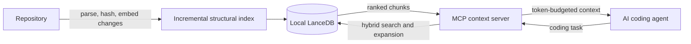

# code-intel

[](https://www.npmjs.com/package/@pranitmodi/code-intel)
[](https://github.com/pranitmodi/code-intel/actions/workflows/ci.yml)
[](LICENSE)
[](package.json)

**Give your AI coding agent the right code, not the whole repository.**

AI coding agents find code the expensive way: they list the tree, grep, and read whole files, in every new session. Everything they read stays in the context window you pay for, and most of it is not needed for the task.

`code-intel` indexes a repository once on your machine, keeps that index current while you edit, and answers the agent over the [Model Context Protocol](https://modelcontextprotocol.io) with a small, ranked set of the snippets that matter for the task. It works with Cursor, VS Code with GitHub Copilot, and any other MCP client.

## Results

Measured on this repository across eight labeled coding tasks (find a symbol, explain a subsystem, add a feature, fix a bug, refactor, find tests, locate configuration):

| | Result |
| --- | ---: |
| Input tokens for all eight tasks | **15,589** instead of 233,680 for a list + grep + read-files scan (**93% fewer**) |
| Average reduction per task | **85%** |
| Labeled relevant files found in the top 10 (Recall@10) | **0.96** |
| Rank of the first relevant file (MRR) | **0.92** |
| `get_task_context` latency, median / slowest, including embedding the query | 58 ms / 152 ms |

Version 0.3.0 sends 41% fewer tokens than 0.2.0 for the same tasks at the same Recall@10, and precision@5 rose from 0.30 to 0.43 ([what changed](CHANGELOG.md)).

These numbers come from one TypeScript repository and one embedding model (`Qwen3-Embedding-8B`), with tokens estimated at four characters per token. They are a regression benchmark, not a promise about your bill. Measure your own repositories with `code-intel benchmark` and `code-intel savings --benchmark`. See [the methodology](docs/BENCHMARKS.md).

## What makes it different

- **Task-sized answers, not search hits.** `get_task_context` finds the definition, the files it imports, and related tests and configuration. It then drops duplicates and weak matches and stops at a token budget. A "where is `X` implemented?" question returns the definition, not eight loosely similar files.
- **Indexed once, shared everywhere.** The index lives on disk outside your repository. Cursor, VS Code, Claude Code, and Codex query the same index instead of each re-reading the tree.
- **Always current.** The MCP server watches the repository and re-embeds only the chunks that changed. Renames, moved folders, `.gitignore` edits, and provider outages are handled.
- **Honest about confidence.** Every answer carries a confidence score. When the index is stale or the match is weak, the agent is told to fall back to a targeted file search instead of trusting a thin result.
- **Local by default.** With the default [Ollama](https://ollama.com) provider, source, embeddings, and the [LanceDB](https://lancedb.github.io/lancedb/) database never leave your machine. There is no telemetry. An OpenAI-compatible embeddings endpoint is supported when you need one.

## Quick start

Requires Node.js 20+ and either [Ollama](https://ollama.com/download) (the default) or an OpenAI-compatible embeddings endpoint.

```bash
npm install -g @pranitmodi/code-intel
cd /path/to/your-project

code-intel onboard                        # Cursor
code-intel onboard --vscode --no-cursor   # VS Code and GitHub Copilot
code-intel onboard --vscode               # both
```

Each command pulls the embedding model if it is missing, indexes the repository, and wires the editor: the MCP server plus the instructions that tell the agent to retrieve before it searches.

Then reload the editor. In VS Code, open the repository with **File → Open Folder** and check **MCP: List Servers**. In Cursor, reload MCP under **Settings → MCP**. From then on, the agent calls `get_task_context` before touching files, and new or edited code is indexed automatically.

Without a global install: `npx -y @pranitmodi/code-intel onboard --repo /path/to/your-project`.

## How it works



**Write path:** discover files (respecting `.gitignore` and skipping secrets), split them into symbol-level chunks with Tree-sitter, hash each chunk, and embed only chunks whose hash changed.

**Read path:** embed the task, combine vector, keyword, symbol, and file-name matches, and expand to imports, references, tests, and configuration. Then remove near-duplicates and padding, and pack the rest under a token budget with a confidence score.

Details: [architecture](docs/ARCHITECTURE.md) and [security model](SECURITY.md).

## Editor setup

`onboard` does this for you. Run the installers directly to re-wire an editor; rerunning them is safe.

### Cursor

```bash
code-intel cursor-install
```

This adds the server to `~/.cursor/mcp.json` without touching your other servers. It also writes a short always-on rule and a skill, and installs two hooks. One tells each new session which indexed repositories match the open folder. The other blocks Task `explore` subagents, and blocks repository-wide Grep and Glob unless retrieval reported low confidence. Searches scoped to a file or subfolder stay allowed. Reload MCP under **Settings → MCP**.

### VS Code and GitHub Copilot

```bash
code-intel vscode-install              # your user profile, every workspace
code-intel vscode-install --workspace  # this repository only (.vscode/mcp.json), committable
```

This merges VS Code's `mcp.json`, keeping other servers and comments, and writes an always-applied Copilot instructions file that tells Copilot to retrieve before it searches. Stable, Insiders, and VSCodium are detected; use `--user-dir` to override. VS Code has no hooks, so the instructions file does the steering.

Two differences from Cursor worth knowing:

- **Open one folder.** VS Code expands `${workspaceFolder}` only when the window has a single folder open. An empty window or a multi-root `.code-workspace` leaves it unset; the server still starts, but it has no default repository, so each tool call has to name one with `repo`.
- **Credentials are prompted, not stored.** When the embedding provider is OpenAI-compatible, the installer wires `${input:…}` prompts, so VS Code asks for the key once and keeps it in its own secret storage rather than in `mcp.json`. Leave the user-name prompt blank if your endpoint doesn't need one.

Confirm the result with **MCP: List Servers**. A hand-written entry looks like this ([example](examples/mcp/vscode.mcp.json)); `type` is required or VS Code skips the entry:

```json
{
  "servers": {
    "local-code-intelligence": {
      "type": "stdio",
      "command": "code-intel",
      "args": ["mcp", "--repo", "${workspaceFolder}"]
    }
  }
}
```

### Other MCP clients

Run `code-intel mcp --repo /path/to/repo` as a stdio server. Cursor's file uses `mcpServers` instead of `servers` and doesn't need `type` ([example](examples/mcp/cursor.mcp.json)).

## MCP tools

| Tool | Use it for |
| --- | --- |
| `get_task_context` | First call for any new or broad task: ranked snippets, related files, confidence, within a token budget (`mode`: `minimal`, `normal`, `deep`) |
| `search_symbol` | A known function, class, or type name |
| `search_codebase` | Conceptual search with an optional `max_tokens` cap |
| `find_references` | Where an identifier appears (textual, not compiler-resolved) |
| `get_file_context` | Exact current source for a line range, read from disk |
| `get_repo_context`, `list_indexed_repos`, `index_status` | Orientation and index health |

Every tool accepts an optional `repo` (path, id, or name), so an editor opened on a parent folder can address each indexed child.

## Keeping the index current

Auto-indexing is on by default. The MCP server your editor starts:

- re-indexes new, edited, renamed, and deleted files after a quiet period (`indexing.debounce_ms`, default 1 second), re-embedding only changed chunks;
- adds or removes folders moved into or out of the repository, and rescans when `.gitignore` changes;
- retries with backoff (2 seconds up to 5 minutes) when the embedding provider is down or another editor holds the index lock, and catches up on changes made while no editor was open;
- picks up repositories indexed after it started within 30 seconds. A subfolder uses its owning repository, and a parent folder watches every indexed child.

Several editors can share one index; an atomic lock serializes writers. To turn watching off, set `indexing.watch: false` or `CODE_INTEL_WATCH=0`, or start the server with `code-intel mcp --no-watch`. `code-intel index` refreshes on demand.

## Embedding providers

**Ollama (default).** `nomic-embed-text` runs locally; `code-intel onboard` or `code-intel doctor --fix` pulls it if it's missing.

**OpenAI-compatible.** Any `/embeddings` service works: a hosted provider, an organization gateway, or a local server. `code-intel wizard` prompts for the endpoint, model, and key, validates them, rebuilds the index, and wires the editor. For scripted rollouts:

```bash
export CODE_INTEL_EMBEDDING_API_KEY=...   # read from the environment only, never from YAML
code-intel corporate-setup --non-interactive \
  --model your-embedding-model \
  --base-url https://embeddings.example.com/v1 \
  --embeddings-path /embeddings
```

The editor starts the MCP server, so put the same `CODE_INTEL_EMBEDDING_*` variables in the server's `env` block so it can embed queries. For a company certificate authority, `embedding.use_system_ca: true` trusts the system store without disabling TLS verification; older Node releases can use `NODE_EXTRA_CA_CERTS`. Switching models requires `code-intel rebuild`. Check the provider's retention and training policy before indexing private code.

## Privacy

- With a local Ollama host, source, chunks, embeddings, and the database stay on this machine.
- With an OpenAI-compatible provider, chunks and search queries go to that endpoint; embeddings and the database stay local.
- There is no telemetry. `.env*` files, private keys, and files containing likely secret values are skipped by default.
- The index stores source text under `~/.local-code-intelligence` (override with `database.path` or `CODE_INTEL_DB_PATH`), never inside your repository.

See [SECURITY.md](SECURITY.md) before indexing private code.

## Measuring savings on your code

```bash
code-intel savings --benchmark --rate 3 --turns 15
```

For each indexed repository, this compares a typical agent scan (list files, `rg -C 2`, read the first 12 matching files) with the exact `get_task_context` response. `--rate` is your input price per million tokens, and `--turns` models a dump that stays in context for later turns. Live MCP calls and blocked scans are logged to `~/.local-code-intelligence/usage.jsonl`, so re-running `code-intel savings` after real work shows actual session totals. It estimates input tokens avoided; it cannot see your invoice.

`code-intel benchmark` runs the labeled retrieval benchmark, and `code-intel context "<task>" --explain` shows why each snippet was chosen.

## CLI

```text
code-intel onboard [--vscode] [--no-cursor]   first-time setup: model, index, editor wiring
code-intel wizard                  interactive Ollama or OpenAI-compatible setup
code-intel setup [--cursor] [--vscode]   index and optionally wire editors
code-intel status                  index size, freshness, last watcher error
code-intel context "<task>"        what get_task_context would return (--explain, --mode, --max-tokens)
code-intel search "<query>"        hybrid search (--explain for the score breakdown)
code-intel symbol <name>           symbol lookup
code-intel index | rebuild | clean incremental index, full rebuild, remove the index
code-intel repos                   list indexed repositories
code-intel cursor-install          wire Cursor (MCP, rule, skill, hooks)
code-intel vscode-install [--workspace]  wire VS Code MCP and Copilot instructions
code-intel doctor [--fix]          check provider, model, credentials, and storage
code-intel savings [--benchmark]   estimated token and dollar savings
code-intel benchmark               labeled retrieval benchmark
code-intel mcp [--no-watch]        run the MCP server over stdio
```

Every command accepts `--repo <path>` and the `--embedding-*` overrides. Run `code-intel --help` for the full list.

## Configuration

Settings merge in this order, later wins: built-in defaults, `~/.local-code-intelligence/config.yaml`, the repository's `.code-intel/config.yaml`, environment variables, then CLI flags. The settings people change most:

| Setting | Default | Purpose |
| --- | --- | --- |
| `embedding.provider` / `embedding.model` | `ollama` / `nomic-embed-text` | Embedding backend |
| `indexing.watch` | `true` | Auto-index from the MCP server |
| `indexing.debounce_ms` | `1000` | Quiet period before re-indexing |
| `retrieval.max_context_tokens` | `12000` | Upper bound for `get_task_context` (normal mode packs up to 8,000) |
| `ignore` | `[]` | Extra gitignore-style patterns to skip |

<details>
<summary>Full default configuration and environment variables</summary>

```yaml
embedding:
  provider: ollama                 # or openai-compatible
  model: nomic-embed-text
  host: http://127.0.0.1:11434     # Ollama only
  base_url: https://api.example.com/v1   # openai-compatible only
  embeddings_path: /embeddings
  batch_size: 32
  timeout_ms: 60000
  use_system_ca: false
database:
  path: ~/.local-code-intelligence
indexing:
  max_chunk_tokens: 800
  chunk_overlap: 100
  debounce_ms: 1000
  watch: true
  concurrency: 4
search:
  default_limit: 10
  vector_weight: 0.7
  keyword_weight: 0.2
  symbol_weight: 0.1
  path_weight: 0.05
  structural_weight: 0.05
  dependency_weight: 0.08
  reference_weight: 0.08
  test_weight: 0.03
  recency_weight: 0.02
  max_chunks_per_file: 4
  max_chunks_per_symbol: 2
retrieval:
  seed_results: 8
  max_expansion_hops: 2
  max_context_chunks: 20
  max_context_tokens: 12000
  confidence_threshold: 0.15
  retrieval_required: true
  allow_fallback_after_failed_retrieval: true
security:
  allow_sensitive_files: false
ignore: []
```

Environment variables: `CODE_INTEL_EMBEDDING_PROVIDER`, `CODE_INTEL_EMBEDDING_MODEL`, `CODE_INTEL_EMBEDDING_HOST`, `CODE_INTEL_EMBEDDING_BASE_URL`, `CODE_INTEL_EMBEDDING_PATH`, `CODE_INTEL_EMBEDDING_BATCH_SIZE`, `CODE_INTEL_EMBEDDING_TIMEOUT_MS`, `CODE_INTEL_EMBEDDING_API_KEY`, `CODE_INTEL_EMBEDDING_USER`, `CODE_INTEL_USE_SYSTEM_CA`, `CODE_INTEL_DB_PATH`, `CODE_INTEL_WATCH`, `CODE_INTEL_INDEX_CONCURRENCY`.

</details>

## Troubleshooting

- **Anything odd:** `code-intel doctor` checks the provider, model, credentials, and index storage.
- **"Model not found":** `ollama pull <model>` for the configured `embedding.model`, or `code-intel doctor --fix`.
- **Tools missing in the editor:** reload the MCP server list and read the server's stderr in the editor's MCP log.
- **VS Code: no default repository, or a warning that `--repo` got no path:** the window has no folder open, or it is a multi-root workspace where `${workspaceFolder}` does not expand. Open the repository with **File → Open Folder**, use `${workspaceFolder:<name>}` for one root of a multi-root workspace, or put an absolute path in `mcp.json`.
- **VS Code: embedding calls fail with 401 or 403:** the saved answer to a `${input:…}` prompt is wrong. Clear the stored inputs from the server's entry in **MCP: List Servers** and start it again, or replace the `${input:…}` values in `mcp.json` with variables your company environment already provides.
- **Recent edits not in results:** `code-intel status` (or the `index_status` tool) shows staleness and the last watcher error. `[WATCH]` lines in the MCP log list the watched repositories.
- **Proxy authentication failures:** set `CODE_INTEL_EMBEDDING_API_KEY` (and `CODE_INTEL_EMBEDDING_USER` if the endpoint needs it) in both your shell and the MCP server's `env`.
- **Changed embedding model:** run `code-intel rebuild`; vectors from different models are not comparable.

## Limitations

- Symbol-level chunking covers TypeScript/TSX, JavaScript, Python, Go, and Bash. Other languages are indexed as text windows.
- `find_references` matches text; it does not resolve references like a compiler.
- Import expansion understands relative JavaScript/TypeScript paths, root `tsconfig` aliases, and Python modules only.
- Watching runs inside the MCP server or `code-intel watch`, not as a system service; changes made while neither runs are caught up at the next start.
- The published metrics come from one repository. Quality on large polyglot monorepos is not yet measured.

## Contributing

```bash
npm install && npm run build
npm run typecheck && npm test
npm run dev -- <command>   # run the CLI from source
```

Start with [CONTRIBUTING.md](CONTRIBUTING.md). Report vulnerabilities through [SECURITY.md](SECURITY.md). Released under the [MIT license](LICENSE).
