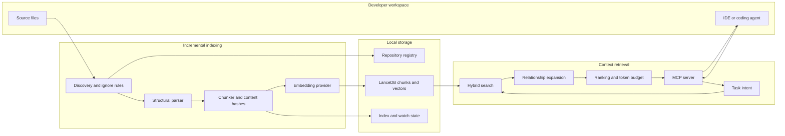
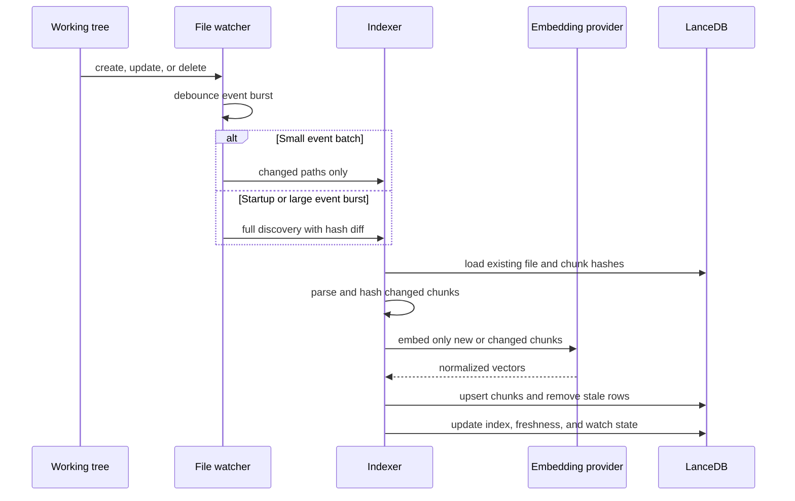
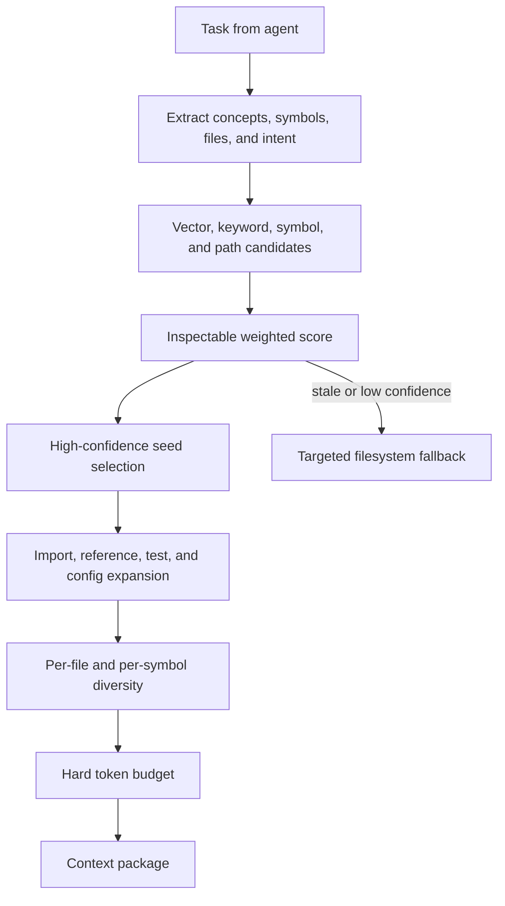

# Architecture

`code-intel` is a persistent, local-first context layer for coding agents. It separates the expensive write path—discovering, parsing, and embedding source—from the interactive read path that retrieves a small context package for each task.

## System overview



The index lives under `~/.local-code-intelligence` by default, outside the repository. Source text is stored with each indexed chunk so retrieval does not need to scan the working tree. `get_file_context` remains authoritative for exact current file content.

## Incremental indexing



Important properties:

- A SHA-256 file hash decides whether a file changed.
- Normalized chunk hashes reuse embeddings when surrounding line numbers move.
- Content-identical renames update paths without re-embedding.
- Small watcher batches update individual paths; bursts above the threshold use full discovery.
- A single-writer PID lock prevents concurrent index corruption.
- A stable content sample complements file-count checks so edits can mark the index stale even when no files were added or removed.
- Watch failures and lock skips are persisted and exposed by `index_status`.

The watcher belongs to the MCP or `code-intel watch` process. If that process is stopped, changes are caught up by the next MCP startup or explicit `code-intel index`.

## Chunking and metadata

Tree-sitter creates symbol-aware chunks for:

- TypeScript and TSX
- JavaScript
- Python
- Go
- Bash

Other detected languages use bounded text windows. Every chunk records file path, language, symbol identity when available, line range, content hashes, embedding, and lightweight metadata such as imports, exports, referenced identifiers, test status, and configuration status.

Files larger than the safety cap, binary files, ignored paths, and likely secrets are skipped. Oversized symbols are split before embedding.

## Retrieval pipeline



The final score combines semantic similarity, full-text relevance, exact symbol matching, path matching, structural information, relationship signals, test intent, and recency. Exact symbols and exact basenames receive floors so a definition is not buried under vaguely similar vector hits.

`get_task_context` then:

1. Generates and merges candidates.
2. Selects high-scoring seeds.
3. Expands relative imports, TypeScript path aliases, Python modules, references, tests, and configuration files.
4. Limits expansion-only files near the top.
5. Applies per-file and per-symbol caps.
6. Packs chunks under the requested token budget.
7. Returns files in score order with confidence and retrieval statistics.

If the index is stale, results are empty, confidence is below the threshold, or a code-change query ranks documentation first, the Cursor integration temporarily permits targeted filesystem search.

## MCP boundary

The MCP server exposes:

- `get_task_context` for broad coding tasks
- `search_symbol` for known identifiers
- `search_codebase` for conceptual exploration
- `find_references` for textual occurrence lookup
- `get_file_context` for authoritative source ranges
- `get_repo_context`, `list_indexed_repos`, and `index_status` for orientation

The same index can serve Cursor, VS Code, Claude Code, Codex, or another MCP client. Each tool accepts an optional repository path, ID, or basename, allowing one parent workspace to address multiple indexed child repositories.

## Provider and privacy boundary

The embedding interface has two implementations:

- **Ollama**: source chunks, queries, vectors, and database stay on the machine.
- **OpenAI-compatible**: source chunks and semantic queries are sent to the configured endpoint; vectors and LanceDB stay local.

Credentials are read from environment variables only. They are never read from repository YAML or stored in the index. See [SECURITY.md](../SECURITY.md) for the security model and reporting process.

## Storage layout

```text
~/.local-code-intelligence/
├── config.yaml
├── registry.json
├── usage.jsonl
└── repos/
    └── <repo-id>/
        ├── db/
        ├── metadata/
        ├── state.json
        ├── progress.json
        ├── watch-status.json
        └── logs/
```

The repository ID is derived from its canonical absolute path. Index state records the embedding model and dimensions; changing models requires `code-intel rebuild`.

## Current limitations

- Structural symbols are unavailable for languages without a configured Tree-sitter grammar.
- `find_references` is textual occurrence matching, not compiler-grade semantic resolution.
- Relationship metadata is intentionally lightweight rather than a complete code graph.
- TypeScript aliases are loaded from root `tsconfig.json` or `jsconfig.json`; project references and framework-specific resolvers may need targeted filesystem fallback.
- Python import expansion is path-based and does not execute package resolution.
- Query quality benchmarks currently cover a small labeled TypeScript repository; they do not prove equal results on every language or monorepo.
- The watcher is process-scoped, not a system daemon.

## Extension points

- Add structural languages in `src/parser/languageRegistry.ts`.
- Add embedding providers behind `EmbeddingProvider`.
- Add ranking signals in `src/retrieval/score.ts`.
- Add relationship resolvers in `src/retrieval/taskContext.ts`.
- Add MCP tools in `src/mcp/server.ts`, while keeping high-level context retrieval the preferred interface.
