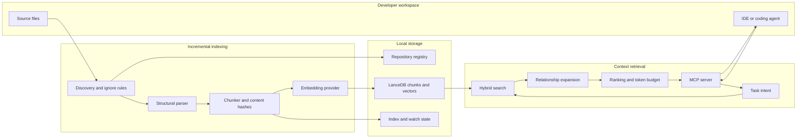
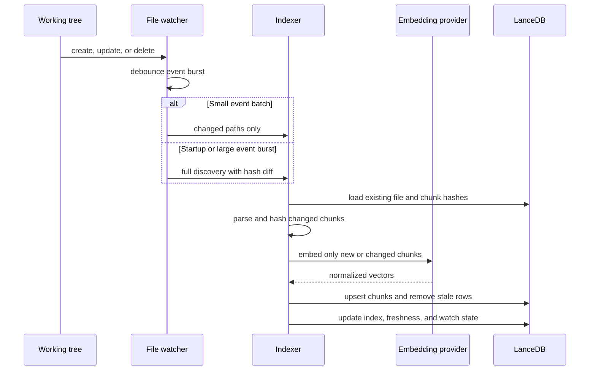
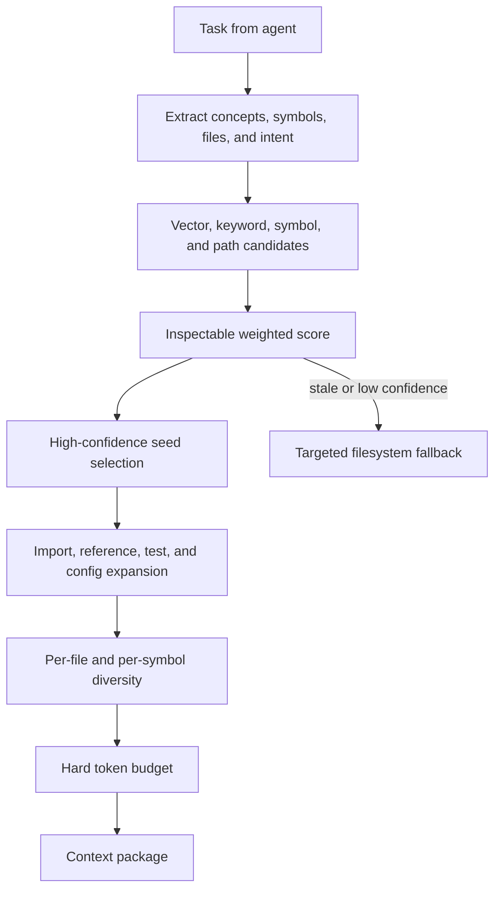

# Architecture

`code-intel` is a persistent, local-first context layer for coding agents. It separates the expensive write path—discovering, parsing, and embedding source—from the interactive read path that retrieves a small context package for each task.

## System overview


```mermaid
flowchart LR
  subgraph workspace [Developer workspace]
    source[Source files]
    editor[IDE or coding agent]
  end

  subgraph indexing [Incremental indexing]
    discovery[Discovery and ignore rules]
    parser[Structural parser]
    chunker[Chunker and content hashes]
    embeddings[Embedding provider]
  end

  subgraph storage [Local storage]
    registry[Repository registry]
    vectors[LanceDB chunks and vectors]
    state[Index and watch state]
  end

  subgraph retrieval [Context retrieval]
    mcp[MCP server]
    intent[Task intent]
    search[Hybrid search]
    expansion[Relationship expansion]
    selection[Ranking and token budget]
  end

  source --> discovery --> parser --> chunker
  chunker --> embeddings --> vectors
  chunker --> state
  discovery --> registry

  editor --> mcp --> intent --> search
  vectors --> search --> expansion --> selection
  selection --> mcp --> editor
```

The index lives under `~/.local-code-intelligence` by default, outside the repository. Source text is stored with each indexed chunk so retrieval does not need to scan the working tree. `get_file_context` remains authoritative for exact current file content.

## Incremental indexing


```mermaid
sequenceDiagram
  participant FS as Working tree
  participant Watch as File watcher
  participant Indexer as Indexer
  participant Embed as Embedding provider
  participant DB as LanceDB

  FS->>Watch: create, update, or delete
  Watch->>Watch: debounce event burst
  alt Small event batch
    Watch->>Indexer: changed paths only
  else Startup or large event burst
    Watch->>Indexer: full discovery with hash diff
  end
  Indexer->>DB: load existing file and chunk hashes
  Indexer->>Indexer: parse and hash changed chunks
  Indexer->>Embed: embed only new or changed chunks
  Embed-->>Indexer: normalized vectors
  Indexer->>DB: upsert chunks and remove stale rows
  Indexer->>DB: update index, freshness, and watch state
```

Important properties:

- A SHA-256 file hash decides whether a file changed.
- Normalized chunk hashes reuse embeddings when surrounding line numbers move.
- Content-identical renames update paths without re-embedding.
- Small watcher batches update individual paths; bursts above the threshold use full discovery. Directory events expand to the files under them, and `.gitignore` changes force full discovery.
- Watcher event paths are mapped back from their symlink-resolved form to the configured repository root.
- An atomic (`O_EXCL`) lock file serializes writers across processes. A lock whose process is gone is reclaimed; the writer then checks out the latest LanceDB table version before merging, so concurrent processes never write from a stale version.
- A stable content sample complements file-count checks so edits can mark the index stale even when no files were added or removed.
- Failed or lock-blocked watch batches are requeued and retried with exponential backoff. Failures are persisted and exposed by `index_status`.

The watcher belongs to the MCP or `code-intel watch` process. The MCP server rechecks the registry every 30 seconds to watch repositories indexed later and to stop watching removed ones. If that process is stopped, changes are caught up by the next MCP startup or explicit `code-intel index`.

## Chunking and metadata

Tree-sitter creates symbol-aware chunks for:

- TypeScript and TSX
- JavaScript
- Python
- Go
- Bash

Other detected languages use bounded text windows.

The structural chunker (`src/chunker/structural.ts`) walks each file's top-level statements, so every line except imports lands in exactly one chunk:

- **Declarations:** functions, classes, interfaces, types, enums, `const` arrow functions, and large constants or schemas. Each keeps its leading doc comment and `export`.
- **Classes:** a header chunk (declaration and fields, plus a `defines` list of members with line ranges) and one chunk per method, so method text is never stored twice.
- **Registrations:** `program.command('x')`, `server.registerTool('x')`, and routes become `command` chunks named by the string.
- **Tests:** `describe`/`it` calls become `test` chunks named by title.
- **Everything else:** grouped into `block` chunks.
- **Oversized functions:** split at statement boundaries, with registrations in their bodies split out.

Every chunk records:

- file path, language, symbol identity when available, and line range;
- content hashes and the embedding;
- lightweight metadata: imports, exports, referenced identifiers, test and configuration status, and, from the syntax tree, the signature, called names, and code-shaped string literals (commands, flags, env keys).

`CHUNKER_VERSION` in `src/chunker/version.ts` triggers a one-time re-chunk when these rules change. Embeddings are reused wherever chunk text is unchanged.

Files larger than the safety cap, binary files, ignored paths, and likely secrets are skipped. Oversized symbols are split before embedding.

## Retrieval pipeline


```mermaid
flowchart TB
  task[Task from agent]
  analyze[Extract concepts, symbols, files, and intent]
  candidates[Vector, keyword, symbol, and path candidates]
  score[Inspectable weighted score]
  seed[High-confidence seed selection]
  relationships[Import, reference, test, and config expansion]
  diversity[Per-file and per-symbol diversity]
  budget[Hard token budget]
  context[Context package]
  fallback[Targeted filesystem fallback]

  task --> analyze --> candidates --> score --> seed
  seed --> relationships --> diversity --> budget --> context
  score -->|"stale or low confidence"| fallback
```

The score combines semantic similarity, full-text relevance, symbol and path matches, structural information, relationship signals, test intent, and recency. When the same chunk arrives from several sources, the stronger score wins; summing them was measured and ranked worse.

Exact matches get score floors, so a definition is not buried under vaguely similar vector hits. The floors only apply to evidence that is actually exact:

- a symbol named in the query as a whole word;
- an identifier from the task that no chunk defines, such as a configuration key, found by keyword search;
- a file whose full name, or a multi-word stem of six or more characters, appears in the query;
- a lower floor for a file whose stem parts all appear as separate query words, except generic stems (`index`, `types`, `config`, ...) and data files.

Prose (Markdown, reStructuredText, plain text, README, CHANGELOG) keeps full weight for documentation questions, gets 0.85 for "how/why/explain" questions, and 0.7 for "where/fix/add" work. It never receives exact-match floors unless the question is about docs.

A request that lists several things is split into facets deterministically (`src/retrieval/facets.ts`). Clauses and list items become facets; commands, flags, env keys, identifiers, and file names anchor them; "versus" and "/" keep both sides in one facet. For such a request:

- **Retrieval.** Each facet gets its own semantic, keyword, and file-name search. The task and all facets are embedded in one provider call.
- **Relevance.** A chunk's relevance to a facet (`src/retrieval/coverage.ts`) is 1 for an exact anchor match. Otherwise it is half the facet's words the chunk contains, weighted by rarity among the candidates, and half its rank in the facet's own search. It never depends on a model's similarity scale.
- **Selection.** A greedy budgeted-coverage pick takes whichever chunk adds the most uncovered facet weight per unit of cost, so every part gets evidence before any part gets a second chunk.
- **Coverage and confidence.** Each facet is reported `covered`, `weak`, or `missing`; the reply is `complete` when no part is missing and weak parts carry little weight. The confidence score is the covered share.
- **Follow-ups.** The best unsent chunks for weak or missing parts become the reply's `Next` reads.

A focused request keeps the single-query pipeline below unchanged.

`get_task_context` then:

1. Generates and merges candidates, including files whose names match the task or a configuration concept.
2. Selects high-scoring seeds.
3. Expands relative imports, TypeScript path aliases, Python modules, references, tests, and configuration files.
4. Limits expansion-only files near the top.
5. Applies per-file and per-symbol caps, and drops chunks that repeat 80% or more of an already selected chunk's words.
6. Stops early. A definition lookup ("where is `X`") with an exact symbol match returns only exact matches. Otherwise results end at the first score gap of 0.15 or more once two non-exact files are kept. Exact matches are never cut.
7. Packs chunks under the token budget (normal mode: 8,000 tokens).

**Reply format.** By default the MCP server replies in plain text:

- a manifest line (repo name, `ctx`, coverage or confidence, token estimate);
- one line per facet with references to the blocks that cover it;
- at most three exact `Next` calls when incomplete;
- `### [n] path:start-end symbol` blocks of raw code.

There are no absolute paths, per-signal scores, or timestamps, so identical retrievals give identical bytes. `CODE_INTEL_MCP_FORMAT=json` returns the compact JSON payload instead. The score breakdown and retrieval trace stay available through `code-intel context --explain`. The benchmarks count the exact reply.

**Conversation contexts.** Each reply names a `ctx` (`src/mcp/session.ts`). Later calls in the same conversation that pass it back replace unchanged code already sent with a one-line note:

- `get_task_context`, `get_file_context`, and `search_codebase` all accept it.
- Lines are compared by hash, so edited code is resent.
- An exact re-request of a range is answered in full, in case the client dropped it from context.
- Contexts are keyed by id rather than by process, because Cursor and VS Code serve several chats from one server.

**File ranges.** `get_file_context` reads batched `ranges`. It caps each range and each call, and names what it left out.

**Freshness.** Staleness comes from the live watcher, or from a cached check that never delays a reply by more than 150 ms. No tool call walks the working tree.

If the index is stale, results are empty, confidence is below the threshold, or a code-change query ranks documentation first, the answer says so and the Cursor hook temporarily permits repository-wide filesystem search.

## MCP boundary

The MCP server exposes:

- `get_task_context` for broad coding tasks
- `search_symbol` for known identifiers
- `search_codebase` for conceptual exploration
- `find_references` for textual occurrence lookup
- `get_file_context` for authoritative source ranges
- `get_repo_context`, `list_indexed_repos`, and `index_status` for orientation

The same index can serve Cursor, VS Code, Claude Code, Codex, or another MCP client. Each tool accepts an optional repository path, ID, or basename, allowing one parent workspace to address multiple indexed child repositories.

`code-intel cursor-install` and `code-intel vscode-install` write the same server entry in each client's own format: Cursor reads `mcpServers` and supports rules, skills, and hooks, while VS Code reads `servers`, requires an explicit `stdio` type, and is steered by an `applyTo: '**'` instructions file because it has no hook mechanism.

## Provider and privacy boundary

The embedding interface has two implementations:

- **Ollama**: source chunks, queries, vectors, and database stay on the machine.
- **OpenAI-compatible**: source chunks and semantic queries are sent to the configured endpoint; vectors and LanceDB stay local.

Credentials are read from environment variables only. They are never read from repository YAML or stored in the index. See [SECURITY.md](../SECURITY.md) for the security model and reporting process.

## Storage layout

```text
~/.local-code-intelligence/
├── config.yaml
├── registry.json
├── usage.jsonl
└── repos/
    └── <repo-id>/
        ├── db/
        ├── metadata/
        ├── state.json
        ├── progress.json
        ├── watch-status.json
        └── logs/
```

The repository ID is derived from its canonical absolute path. Index state records the embedding model and dimensions; changing models requires `code-intel rebuild`.

## Current limitations

- Structural symbols are unavailable for languages without a configured Tree-sitter grammar.
- `find_references` is textual occurrence matching, not compiler-grade semantic resolution.
- Relationship metadata is intentionally lightweight rather than a complete code graph.
- TypeScript aliases are loaded from root `tsconfig.json` or `jsconfig.json`; project references and framework-specific resolvers may need targeted filesystem fallback.
- Python import expansion is path-based and does not execute package resolution.
- Query quality benchmarks currently cover a small labeled TypeScript repository; they do not prove equal results on every language or monorepo.
- Facet splitting is rule-based. A request written as one long sentence with no list structure stays a single facet.
- Facet coverage judges relevance from word overlap and each facet's search ranking; it is not a semantic judgment of whether the code answers the part.
- The session benchmark models follow-up turns; it does not yet drive live agents in Cursor, VS Code, or Claude Code.
- The watcher is process-scoped, not a system daemon.

## Extension points

- Add structural languages in `src/parser/languageRegistry.ts`.
- Add embedding providers behind `EmbeddingProvider`.
- Add ranking signals in `src/retrieval/score.ts`.
- Add relationship resolvers in `src/retrieval/taskContext.ts`.
- Add MCP tools in `src/mcp/server.ts`, while keeping high-level context retrieval the preferred interface.
