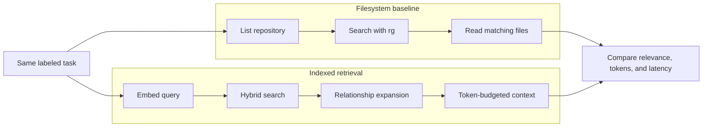

# Benchmarks

This document explains what `code-intel` measures, how to reproduce it, and what the results do—and do not—prove.

## Latest pre-release result

Measured on September 21, 2026 against eight labeled tasks in the `code-intel` TypeScript repository:

| Metric | Result |
| --- | ---: |
| Average per-task token reduction | 73.9% |
| Precision@5 | 0.33 |
| Precision@5 dataset ceiling | 0.40 |
| Relevant-file coverage@5 | 0.85 |
| Recall@10 | 0.96 |
| Mean reciprocal rank | 0.84 |
| NDCG | 0.72 |
| Operation p50 | 67 ms |
| Operation p95 | 708 ms |

The run used `Qwen3-Embedding-8B` through an OpenAI-compatible embedding provider on a macOS development machine. It ran against the final pre-release source and documentation index on September 21, 2026.

### Per-task audit

| Task | Token reduction | Coverage@5 | Recall@10 | MRR | Missing relevant files |
| --- | ---: | ---: | ---: | ---: | --- |
| Known `searchCodebase` symbol | 85.8% | 1.00 | 1.00 | 1.00 | None |
| Conceptual hybrid search | 96.0% | 1.00 | 1.00 | 1.00 | None |
| Task-context feature | 85.3% | 0.50 | 1.00 | 1.00 | None; one relevant file ranked sixth |
| Stale-index bug | 55.5% | 1.00 | 1.00 | 0.20 | None; relevant file ranked fifth |
| Search-ranking refactor | 47.2% | 1.00 | 1.00 | 1.00 | None |
| Cross-cutting MCP instructions | 76.1% | 0.33 | 0.67 | 0.50 | `src/cursor/mcpInstructions.ts` |
| Tree-scan policy tests | 51.0% | 1.00 | 1.00 | 1.00 | None |
| Embedding configuration | 94.1% | 1.00 | 1.00 | 1.00 | None |

## What is compared

For each labeled task, the benchmark compares three paths:

1. **Workspace scan baseline**: list files, run `rg` using a keyword derived from the task, and read matching source.
2. **Semantic search**: retrieve up to ten hybrid-search chunks.
3. **Task context**: run `get_task_context`, expand relationships, rank files, and apply an 8,000-token cap.



Source-bearing payloads are counted using the same estimator used by the CLI: approximately four characters per token. This is deterministic and convenient, but it is not a provider-specific tokenizer.

## Metric definitions

- **Token reduction**: percentage decrease from the workspace-scan payload to the task-context payload. The aggregate is the mean of per-task percentages.
- **Precision@5**: relevant files among the first five returned files, divided by five.
- **Precision@5 ceiling**: maximum possible Precision@5 for the dataset given the number of labeled relevant files. Most tasks label only one to three files, so the aggregate ceiling is 0.40—not 1.00.
- **Relevant-file coverage@5**: fraction of labeled relevant files found in the first five.
- **Recall@10**: fraction of labeled relevant files found in the first ten.
- **MRR**: reciprocal rank of the first relevant file, averaged across tasks.
- **NDCG**: ranking quality using graded file relevance.
- **p50/p95**: retrieval latency percentiles across scan, semantic, and task-context operations recorded by the runner.

## Interpreting token savings

The measured reduction is **model input avoided**, not a direct reading of a Cursor, OpenAI, Anthropic, or cloud invoice.

For an illustrative input price `R` dollars per million tokens:

```text
estimated dollars avoided = avoided input tokens × R / 1,000,000
```

If an unnecessary repository dump remains in a conversation for later turns, the same text may be charged or processed repeatedly. `code-intel savings --turns N` shows that compounding scenario, but it is an estimate and depends on the client, model, caching policy, and conversation behavior.

Do not interpret a 73.9% payload reduction as a guaranteed 73.9% invoice reduction.

## Reproducing the benchmark

Prerequisites:

- a fresh index for this repository;
- the configured embedding provider available;
- `rg` on `PATH`;
- no uncommitted source changes that are absent from the index.

```bash
code-intel status
code-intel index
npm run benchmark:retrieval
```

Run one labeled task:

```bash
npm run dev -- benchmark --format json --task known-search-codebase
```

Inspect one retrieval:

```bash
npm run dev -- context "Where is searchCodebase implemented?" --explain
```

The JSON report includes relevant files, semantic files, retrieved files, missing relevant files, token counts, quality metrics, and latency for every task.

## Dataset scope

The current dataset includes:

- known-symbol lookup;
- conceptual hybrid-search explanation;
- feature work around task context;
- stale-index diagnosis;
- ranking refactoring;
- cross-cutting MCP instruction changes;
- tree-scan policy tests;
- embedding configuration.

The dataset is useful for regression detection inside this project. It is not yet representative of:

- large polyglot monorepos;
- Java, Rust, C++, Swift, or mobile projects;
- compiler-grade references;
- real coding-agent task completion;
- every embedding model or hardware profile.

## Honest failure cases

The current system can still miss or mis-rank:

- conceptual files that share no identifier with the task;
- overloaded short symbols such as `run` or `get`;
- source in languages that use generic text chunks;
- framework aliases not represented in root TypeScript configuration;
- dependencies resolved dynamically at runtime;
- edits made while no watcher is running.

Low-confidence or stale retrieval should open targeted filesystem fallback rather than pretending the context package is complete.

## Adding benchmark tasks

Tasks live in `src/benchmark/datasets/codeIntelTasks.ts`. A useful task must have:

- a realistic coding prompt;
- one or more defensible relevant files;
- graded relevance when some files are secondary;
- a category that improves coverage rather than duplicating an existing prompt.

Benchmark changes should include the before/after JSON, explain traces for regressions, and a justification for any label changes.
