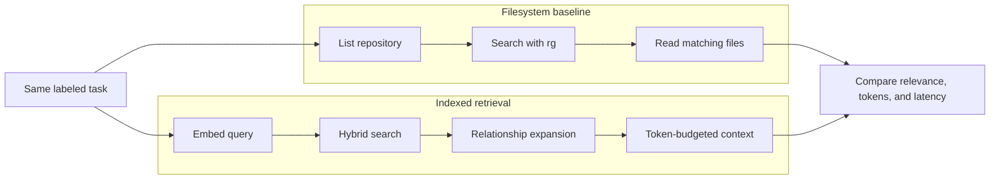

# Benchmarks

What `code-intel` measures, the latest results, how to reproduce them, and what they do and do not prove.

## Latest result

Measured on September 23, 2026 against eight labeled tasks in this repository. Both versions ran against the same index snapshot, using `Qwen3-Embedding-8B` through an OpenAI-compatible provider on a macOS development machine. The 0.2.0 column counts the payload 0.2.0 actually returned: pretty-printed JSON with a per-file score breakdown, summary, and retrieval statistics.

| Metric | 0.2.0 | 0.3.0 |
| --- | ---: | ---: |
| `get_task_context` tokens, all eight tasks | 26,607 | **15,589** (−41%) |
| Workspace-scan tokens, all eight tasks | 233,680 | 233,680 |
| Average per-task reduction vs scan | 75.7% | **85.1%** |
| Precision@5 (of the files returned) | 0.30 | **0.43** |
| Relevant-file coverage@5 | 0.79 | **0.85** |
| Recall@10 | 0.96 | 0.96 |
| MRR | 0.90 | **0.92** |
| NDCG | 0.74 | **0.78** |
| `get_task_context` latency, median / slowest | 58 / 129 ms | 58 / 152 ms |

Latency includes embedding the query. Results move by a few percent between runs because the watcher re-indexes files as they are edited.

### Per-task audit (0.3.0)

| Task | Scan tokens | Task-context tokens | Reduction | Coverage@5 | Recall@10 | MRR | Notes |
| --- | ---: | ---: | ---: | ---: | ---: | ---: | --- |
| Known `searchCodebase` symbol | 29,259 | 356 | 98.8% | 1.00 | 1.00 | 1.00 | Returns only the definition |
| Conceptual hybrid search | 48,383 | 1,248 | 97.4% | 0.67 | 0.67 | 1.00 | Misses `src/retrieval/score.ts` |
| Task-context feature | 48,783 | 3,732 | 92.4% | 1.00 | 1.00 | 1.00 | |
| Stale-index bug | 7,481 | 2,833 | 62.1% | 1.00 | 1.00 | 0.33 | Relevant file ranked third |
| Search-ranking refactor | 5,196 | 1,213 | 76.7% | 1.00 | 1.00 | 1.00 | |
| Cross-cutting MCP instructions | 43,720 | 2,296 | 94.7% | 0.67 | 1.00 | 1.00 | `src/mcp/server.ts` ranked seventh; 0.2.0 missed `mcpInstructions.ts` |
| Tree-scan policy tests | 6,181 | 2,350 | 62.0% | 1.00 | 1.00 | 1.00 | |
| Embedding configuration | 44,677 | 1,561 | 96.5% | 0.50 | 1.00 | 1.00 | `src/config/types.ts` ranked sixth |

Recall@10 is unchanged in aggregate, but the miss moved: 0.3.0 finds `mcpInstructions.ts` for the cross-cutting task and drops `score.ts` from the conceptual one.

## What changed in 0.3.0 and why

About 40% of what 0.2.0 sent was not code. The rest of the savings came from sending fewer, better files.

- **Compact payload.** The MCP server, both benchmarks, and usage recording now serialize the same compact JSON: repository, confidence, token estimate, and for each file its path, reason, a single score, and chunks. Only relationships between files that were sent are included. The pretty-printing, the ten-field score breakdown, the summary, and the retrieval statistics were dropped; `code-intel context --explain` still shows them.
- **Exact matches only where they are exact.** A file counts as "named in the query" only when its full name, or a long multi-word stem, appears in the task. Generic stems such as `index`, `types`, or `config` do not count, and neither do data files. Symbol names match as whole words.
- **Prose weighting.** Markdown and other prose files are down-weighted for "where", "fix", and "add" tasks. They keep full weight when the task is about documentation.
- **Near-duplicate suppression.** Chunks whose words overlap an already selected chunk by 80% or more are dropped.
- **Stopping rule.** For a definition lookup ("where is `X` implemented?") that has an exact symbol match, only exact matches are returned. Otherwise, results stop at the first score gap of 0.15 or more after at least two non-exact files.

One rejected experiment: adding keyword and vector evidence together, instead of taking the stronger of the two, lowered Recall@10 from 0.96 to 0.88 and NDCG from 0.78 to 0.71, so merging keeps the maximum.

### Per-session guidance

The text an agent receives before any tool call also costs tokens, in every session. 0.3.0 trims it and removes provider-specific wording.

| Text | When it is sent | 0.2.0 | 0.3.0 |
| --- | --- | ---: | ---: |
| MCP server instructions | Every session, any client | 224 | 170 |
| Cursor rule | Every Cursor session | 305 | 218 |
| Cursor session hook | Every Cursor session | 416 | 77 |
| Cursor skill | When the agent loads it | 317 | 257 |
| Copilot instructions | Every VS Code Copilot request | 321 | 242 |

The always-on cost in Cursor fell from about 945 to about 465 tokens. The session hook now lists only indexed repositories that overlap the open workspace, up to eight, instead of every indexed repository on the machine.

## What is compared

For each labeled task, the benchmark runs three paths:

1. **Workspace scan**: list files, run `rg -n -C 2` with a keyword derived from the task, and read the top matching files, as an agent without an index would.
2. **Semantic search**: up to ten hybrid-search chunks.
3. **Task context**: `get_task_context` in normal mode (8,000-token budget), counted as the exact payload the MCP server returns.



Tokens are estimated at four characters per token, the same estimator the CLI uses. It is deterministic and provider-neutral, not a model tokenizer.

## Metric definitions

- **Token reduction**: percentage decrease from the workspace-scan payload to the task-context payload. The aggregate is the mean of per-task percentages.
- **Precision@5**: relevant files among the first five returned, divided by the number returned (at most five). Returning fewer, correct files raises it, which is intended.
- **Precision@5 ceiling**: the best score a full five-file answer could reach given how many files each task labels. Most tasks label one to three files, so the ceiling is 0.40. 0.3.0 exceeds it because it often returns fewer than five files.
- **Relevant-file coverage@5**: fraction of labeled relevant files in the first five.
- **Recall@10**: fraction of labeled relevant files in the first ten.
- **MRR**: reciprocal rank of the first relevant file, averaged across tasks.
- **NDCG**: ranking quality using graded file relevance.
- **Latency**: wall time for one `get_task_context` call, including the query embedding. The runner's p50, p95, and p99 lines combine scan, semantic, and task-context operations.

## Savings on your own repositories

`code-intel savings --benchmark` runs an A/B on every indexed repository with three generic tasks (authentication, error handling, API client). One side is a typical agent scan: list files, `rg -C 2` for a keyword, and read the first 12 matching files. The other side is the exact `get_task_context` payload, with no clipping. On this repository the scan averaged 72,086 tokens per task and `get_task_context` averaged 1,082 tokens.

Live MCP calls and blocked tree scans are logged to `~/.local-code-intelligence/usage.jsonl`, so `code-intel savings` also reports the sessions you actually ran.

## Interpreting token savings

The measured reduction is **model input avoided**, not a reading from any provider's invoice. For an input price `R` dollars per million tokens:

```text
estimated dollars avoided = avoided input tokens × R / 1,000,000
```

If an unneeded repository dump stays in the conversation, later turns may process it again. `code-intel savings --turns N` models that, but the real effect depends on the client, model, prompt caching, and how the conversation goes. An 85% smaller payload is not an 85% smaller bill.

## Reproducing the benchmark

Prerequisites:

- a fresh index for this repository;
- the configured embedding provider available;
- `rg` on `PATH`;
- no uncommitted source changes missing from the index.

```bash
code-intel status
code-intel index
npm run benchmark:retrieval
```

Run one labeled task:

```bash
npm run dev -- benchmark --format json --task known-search-codebase
```

Inspect one retrieval:

```bash
npm run dev -- context "Where is searchCodebase implemented?" --explain
```

The JSON report lists relevant, semantic, retrieved, and missing files, token counts, quality metrics, and latency for every task.

## Dataset scope

The dataset covers known-symbol lookup, conceptual explanation, feature work, a stale-index bug, a ranking refactor, a cross-cutting instruction change, finding tests, and configuration. It catches regressions in this project. It is not yet representative of:

- large polyglot monorepos;
- Java, Rust, C++, Swift, or mobile projects;
- compiler-grade references;
- end-to-end coding-agent task completion;
- every embedding model or hardware profile.

## Known failure cases

Retrieval can still miss or mis-rank:

- conceptual files that share no identifier with the task (for example, `score.ts` in the conceptual task);
- overloaded short symbols such as `run` or `get`;
- source in languages indexed as plain text windows;
- framework aliases not declared in the root TypeScript configuration;
- dependencies resolved at runtime;
- edits made while no watcher is running.

Low-confidence or stale retrieval tells the agent to fall back to a targeted filesystem search instead of presenting the package as complete.

## Adding benchmark tasks

Tasks live in `src/benchmark/datasets/codeIntelTasks.ts`. A useful task has:

- a realistic coding prompt;
- one or more defensible relevant files;
- graded relevance when some files are secondary;
- a category that adds coverage instead of repeating an existing prompt.

Benchmark changes should include before and after JSON, explain traces for any regression, and a reason for every label change.
